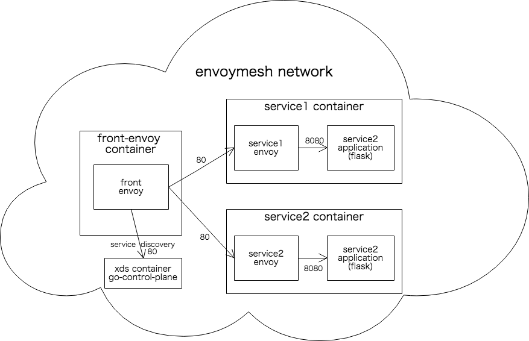

# service-mesh-example

Service mesh example originates from [envoy/example/front-proxy](https://github.com/envoyproxy/envoy/tree/adda57914297f4179ae29e4bb34685124f3e516b/examples/front-proxy) with minimal xDS API Server using with [go-control-plane](https://github.com/envoyproxy/go-control-plane)



## Configuration

- Static front-proxy configuration: `./front-envoy.yaml`
- Dynamic front-proxy configuration with xDS API Server: `./front-envoy-with-xds.yaml`

If you want to use `front-envoy-with-xds.yaml`, apply patch below:

```
diff --git a/docker-compose.yaml b/docker-compose.yaml
index 10735ef..27327cd 100644
--- a/docker-compose.yaml
+++ b/docker-compose.yaml
@@ -5,9 +5,9 @@ services:
       context: .
       dockerfile: Dockerfile-frontenvoy
     volumes:
-      - ./front-envoy.yaml:/etc/front-envoy.yaml
+    # - ./front-envoy.yaml:/etc/front-envoy.yaml
     # With xDS Server configuration
-    # - ./front-envoy-with-xds.yaml:/etc/front-envoy.yaml
+      - ./front-envoy-with-xds.yaml:/etc/front-envoy.yaml
     networks:
       - envoymesh
     expose:
```

## Usage

```
$ docker-compose up --build
```

- Access to service1

```
$ curl localhost:8000/service/1
```

- Access to service2

```
$ curl localhost:8000/service/2
```

- Access to envoy admin page

```
$ curl localhost:8001
```

- Access to prometheus exposition format metrics

```
$ curl localhost:8001/stats/prometheus
```

## xDS API Server

Sample xDS API Server implementation using with [go-control-plane](https://github.com/envoyproxy/go-control-plane)
